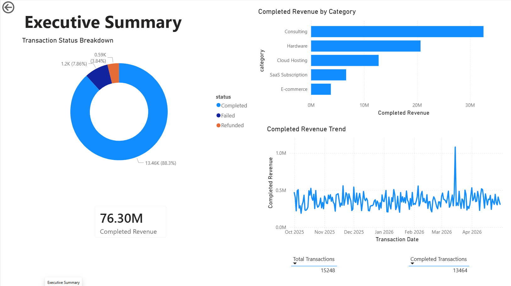
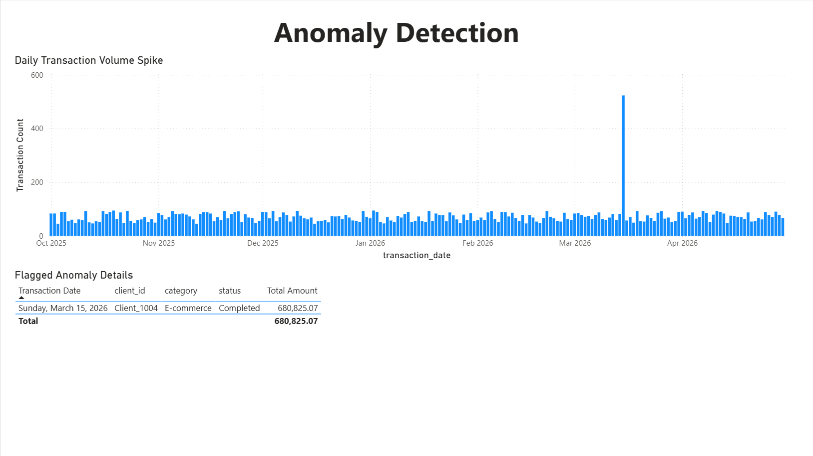

# Business Transaction Analytics Dashboard

A portfolio project simulating a real-world business analytics workflow — from raw transaction data to KPIs, SQL analysis, and visualizations.

---

## What This Project Does

Takes synthetic transaction data spanning October 2025 to April 2026 and runs it through a full analytics pipeline:

- Loads data into a SQLite database
- Calculates KPIs (revenue, failed transaction rate, refund rate)
- Identifies top clients and category breakdowns
- Flags abnormal transaction spikes
- Exports a client insights report
- Generates charts for presentation

---

## Stack

Python · pandas · numpy · SQLite · SQL · matplotlib · Power BI

---

## Dataset

Synthetic data generated for portfolio use. Fields: `transaction_id`, `transaction_date`, `client_id`, `category`, `payment_method`, `status`, `amount`.

One anomaly was intentionally injected: **Client_1004** shows an abnormal E-commerce spike on **2026-03-15** to test the detection logic.

---

## Project Structure

```text
business-transaction-analytics-dashboard/
├── data/
│   ├── raw/transactions.csv
│   ├── processed/transactions.db
│   └── sample/transactions_sample.csv
├── notebooks/
│   ├── generate_data.py
│   ├── create_database.py
│   ├── analyze_transactions.py
│   └── create_charts.py
├── sql/
│   ├── create_tables.sql
│   ├── kpi_queries.sql
│   └── anomaly_queries.sql
├── reports/client_insights_report.md
├── screenshots/
│   ├── daily_transaction_volume.png
│   ├── revenue_by_category.png
│   ├── top_clients_revenue.png
│   ├── powerbi_summary.png
│   └── powerbi_anomaly.png
├── dashboard/
├── README.md
├── requirements.txt
└── .gitignore
```

---

## How to Run

```bash
pip install -r requirements.txt
python notebooks/generate_data.py
python notebooks/create_database.py
python notebooks/analyze_transactions.py
python notebooks/create_charts.py
```

---

## KPIs Tracked

- Total transaction volume
- Completed revenue
- Failed transaction rate
- Refund rate
- Top clients by revenue
- Revenue by category
- Daily transaction trends
- Anomaly flags

---

## Anomaly Example

The spike detection query catches Client_1004's unusual volume on 2026-03-15. In practice, something like this would kick off an investigation — could be a legitimate campaign, a processing error, or something worth escalating to fraud review.

---

## Dashboard Previews

### Power BI: Executive Summary


### Power BI: Anomaly Detection

